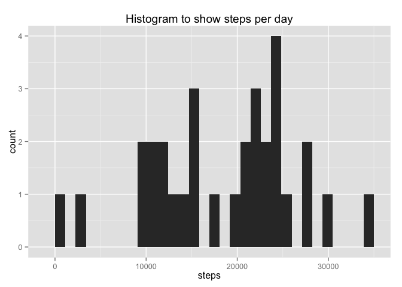
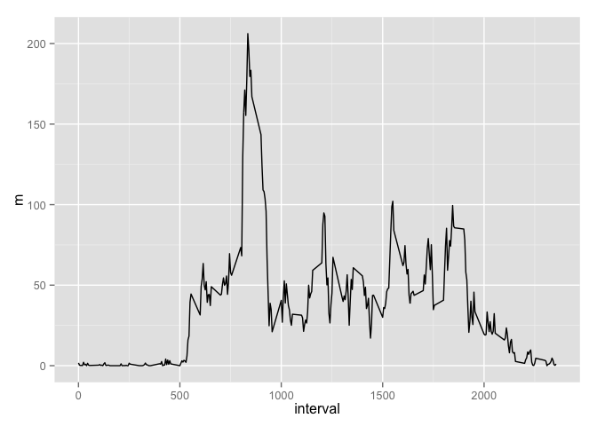
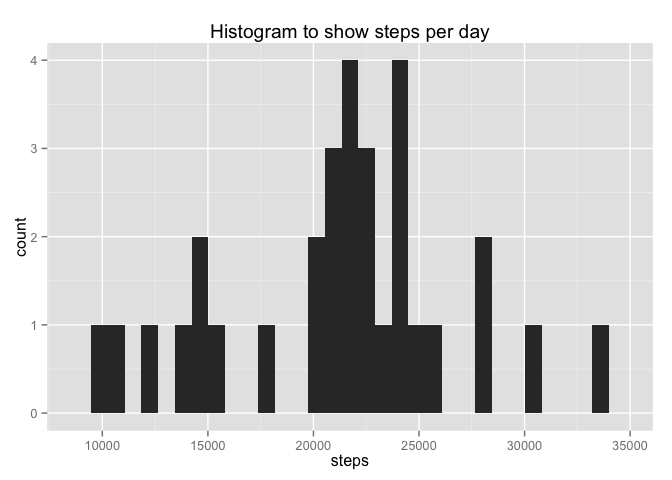
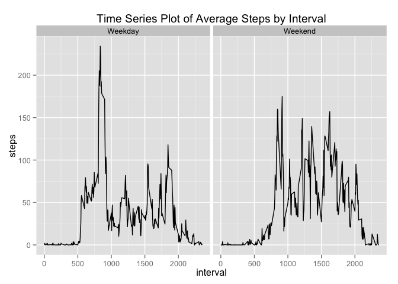

# Reproducible Research: Peer Assessment 1

##Read in the data


```r
dt <- read.csv('activity.csv')
dt$date <- as.POSIXct(dt$date)
```

##Plot a histogram of the data using ggplot2


```r
library(ggplot2)
library(lubridate)
library(dplyr)
```

```
## 
## Attaching package: 'dplyr'
## 
## The following objects are masked from 'package:lubridate':
## 
##     intersect, setdiff, union
## 
## The following object is masked from 'package:stats':
## 
##     filter
## 
## The following objects are masked from 'package:base':
## 
##     intersect, setdiff, setequal, union
```

```r
dt_days <- group_by(dt, day(date))
dt_by_day <- summarise(dt_days, steps = sum(steps, na.rm = TRUE))
qplot(dt_by_day$steps, main = 'Histogram to show steps per day', xlab = "steps")
```

 

##Calculate mean and median

```r
meandt <- mean(dt_by_day$steps, na.rm =  TRUE)
mediandt <- median(dt_by_day$steps, na.rm =  TRUE)
```

The mean is 1.840671\times 10^{4} and the median is 20525.

##Plot the average number of steps per day


```r
dt_int <- group_by(dt, interval)
dt_means <- summarise(dt_int, m = mean(steps, na.rm = TRUE))
qplot(data = dt_means, x = interval, y = m, geom = 'line')
```

 

```r
max_steps <- max(dt_means$m)
max_int <- dt_means[dt_means$m == max_steps,1]
```

The inteval with the highest average step count across all days is 835.

##Inputting missing values


```r
missing_rows <- sum(!complete.cases(dt))
```

The number of incomplete cases is 2304

Use the interval mean if the recorded value is NA.


```r
dt_narm <- merge(x = dt, y = dt_means, by = "interval", all.x = TRUE)
dt_narm[is.na(dt_narm$steps),"steps"] <- dt_narm[is.na(dt_narm$steps),"m"]

dt_narm_days <- group_by(dt_narm, day(date))
dt_narm_by_day <- summarise(dt_narm_days, steps = sum(steps, na.rm = TRUE))
```

Plotting a histogram


```r
qplot(dt_narm_by_day$steps, main = 'Histogram to show steps per day', xlab = "steps")
```

 

##Calculate mean and median

```r
meandt_narm <- mean(dt_narm_by_day$steps, na.rm =  TRUE)
mediandt_narm <- median(dt_narm_by_day$steps, na.rm =  TRUE)
```

The mean is 2.1185081\times 10^{4} and the median is 2.1641\times 10^{4}.

##Are there differences in activity patterns between weekdays and weekends?


```r
dt$weekday <- as.factor(ifelse(weekdays(dt$date) %in% c("Saturday","Sunday"), "Weekend", "Weekday"))

dt_by_wday  <- aggregate(x = dt$steps, 
                   by = list(dt$interval,dt$weekday), 
                   FUN = mean,
                   na.rm=TRUE)
names(dt_by_wday) <- c("interval","weekday","steps")
ggplot(dt_by_wday,
       aes(interval,steps)) +
       ggtitle("Time Series Plot of Average Steps by Interval") +
       facet_grid(. ~ weekday) +
       geom_line()
```

 
